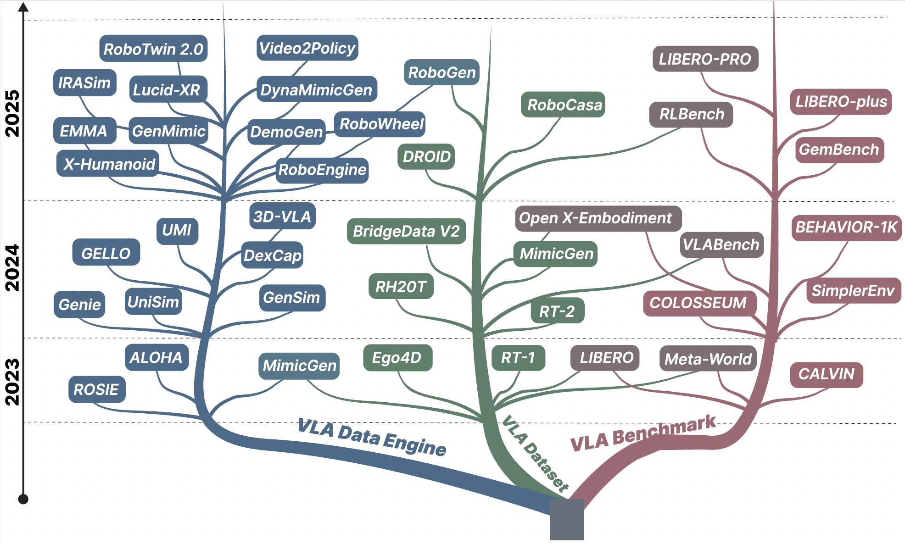

# Vision-Language-Action in Robotics: A Survey of Datasets, Benchmarks, and Data Engines

A curated list of datasets, benchmarks, and data engines for **Vision-Language-Action (VLA)** research.  
This repository focuses on **data formats, evaluation protocols, and benchmark comparability**, with practical guidance on **which dataset/benchmark to use** for different research needs.

> Maintained by: *Ziyao Wang, Bingying Wang, Hanrong Zhang / UMD CaseLab*  
> Scope: datasets + benchmarks + data engines (no model architecture deep dive)

---

## Table of Contents
- [How to Use This List](#how-to-use-this-list)
- [Tag Legend](#tag-legend)
- [Datasets](#datasets)
  - [Real-World Robot Datasets](#real-world-robot-datasets)
  - [Simulation and Synthetic Datasets](#simulation-and-synthetic-datasets)
  - [Multimodal / Tactile / Special Embodiments](#multimodal--tactile--special-embodiments)
- [Benchmarks](#benchmarks)
  - [Tabletop + Simple Tasks](#tabletop--simple-tasks)
  - [Tabletop + Long-Horizon / Complex Tasks](#tabletop--long-horizon--complex-tasks)
  - [Multi-Scene + Simple Tasks](#multi-scene--simple-tasks)
  - [Multi-Scene + Long-Horizon / Complex Tasks](#multi-scene--long-horizon--complex-tasks)
- [Data Engines](#data-engines)
  - [Video-to-Data Engines](#video-to-data-engines)
  - [Hardware-Assisted Engines](#hardware-assisted-engines)
  - [Generative Data Engines](#generative-data-engines)
- [Evaluation Protocols & Metrics](#evaluation-protocols--metrics)
- [Contributing](#contributing)
- [Citation](#citation)

---

## How to Use This List
This repository is organized to answer three practical questions:

1. **What exists?** What datasets and benchmarks are commonly used in VLA research?  
2. **How are they used?** What are the key data formats, action representations, task setups, and evaluation protocols?  
3. **Which should I choose?** Given a research goal (e.g., long-horizon tasks, OOD generalization, sim-to-real), which datasets or benchmarks best match the need?

We keep each entry short and rely on **colored tags** (badges) to highlight key properties.

---

## Tag Legend

### Dataset tags
**Dataset type**
-  real robot data
-  synthetic or simulation-generated data
-  mixed real + synthetic (or mixed sources)

**Action representation**
-  delta (incremental) actions
-  absolute actions
-  mixed / heterogeneous actions

**Control target**
-  end-effector (EEF) control
-  joint (DoF) control
-  mixed / heterogeneous control targets

**Vision modality**
-  image
-  3D (RGB-D / point cloud)
-  video

### Shared task tags (datasets + benchmarks)
-  tabletop
-  multi-scene
-  short-horizon
-  long-horizon

### Data engine tags

**Engine type**
-  video-to-data
-  hardware-assisted
-  generative

**Supervision source**
-  human demonstrations
-  simulation
-  human / internet video
-  hybrid sources

**Deployment style**
-  portable / in-the-wild collection
-  lab-based setup
-  closed-loop world modeling

---



---
# Datasets

## Real-World Robot Datasets

- **Ego4D: Around the World in 3,000 Hours of Egocentric Video**<br>Kristen Grauman, Andrew Westbury, Eugene Byrne et al.
      
Links: [paper](https://openaccess.thecvf.com/content/CVPR2022/papers/Grauman_Ego4D_Around_the_World_in_3000_Hours_of_Egocentric_Video_CVPR_2022_paper.pdf) | [website]() | [code]() [2022, CVPR]

- **RT-1: Robotics Transformer for Real-World Control at Scale**<br>Anthony Brohan, Noah Brown, Justice Carbajal et al.
       
Links: [paper](https://arxiv.org/pdf/2212.06817) | [website]() | [code]() [2022, arXiv]

- **Benchmarking Vision, Language, & Action Models on Robotic Learning Tasks**<br>Pranav Guruprasad, Harshvardhan Sikka, Jaewoo Song, Yangyue Wang, Paul Pu Liang
      
Links: [paper](https://ieeexplore.ieee.org/document/10611477) | [website]() | [code]() [2023, arXiv]

- **RT-2: Vision-Language-Action Models Transfer Web Knowledge to Robotic Control**<br>Brianna Zitkovich, Tianhe Yu, Sichun Xu et al.
     
Links: [paper](https://proceedings.mlr.press/v229/zitkovich23a/zitkovich23a.pdf) | [website](https://proceedings.mlr.press/v229/zitkovich23a.html) | [code]() [2023, PMLR]

- **BridgeData V2: A Dataset for Robot Learning at Scale**<br>Homer Rich Walke, Kevin Black, Tony Z. Zhao, Quan Vuong, Chongyi Zheng, Philippe Hansen-Estruch, Andre Wang He, Vivek Myers, Moo Jin Kim, Max Du, Abraham Lee, Kuan Fang, Chelsea Finn, Sergey Levine
      
Links: [paper](https://proceedings.mlr.press/v229/walke23a/walke23a.pdf) | [website]() | [code]() [2023, PMLR]

- **RH20T: A Comprehensive Robotic Dataset for Learning Diverse Skills in One-Shot**<br>Hao-Shu Fang, Hongjie Fang, Zhenyu Tang, Jirong Liu, Chenxi Wang, Junbo Wang, Haoyi Zhu, Cewu Lu
      
Links: [paper](https://arxiv.org/pdf/2307.00595) | [website]() | [code]() [2023, RSS]

- **DROID: A Large-Scale In-The-Wild Robot Manipulation Dataset**<br>Alexander Khazatsky, Karl Pertsch, Suraj Nair et al.
      
Links: [paper](https://arxiv.org/pdf/2403.12945) | [website]() | [code]() [2024, RSS]

> Note: Ego4D is a human egocentric video dataset (no robot actions), often used for learning visual affordances and priors.

---

## Simulation and Synthetic Datasets

- **MimicGen: A Data Generation System for Scalable Robot Learning using Human Demonstrations**<br>Ajay Mandlekar, Soroush Nasiriany, Bowen Wen, Iretiayo Akinola, Yashraj Narang, Linxi Fan, Yuke Zhu, Dieter Fox
      
Links: [paper](https://arxiv.org/pdf/2310.17596) | [website]() | [code]() [2023, CoRL]

- **RoboGen: Towards Unleashing Infinite Data for Automated Robot Learning via Generative Simulation**<br>Yufei Wang, Zhou Xian, Feng Chen, Tsun-Hsuan Wang, Yian Wang, Katerina Fragkiadaki, Zackory Erickson, David Held, Chuang Gan
      
Links: [paper](https://arxiv.org/pdf/2311.01455) | [website]() | [code]() [2024, ICML]

- **GraspVLA: a Grasping Foundation Model Pre-trained on Billion-scale Synthetic Action Data**<br>Shengliang Deng, Mi Yan, Songlin Wei, Haixin Ma, Yuxin Yang, Jiayi Chen, Zhiqi Zhang, Taoyu Yang, Xuheng Zhang, Wenhao Zhang, Heming Cui, Zhizheng Zhang, He Wang
       
Links: [paper](https://arxiv.org/pdf/2505.03233) | [website]() | [code]() [2025, arXiv]

---

## Multimodal / Tactile / Special Embodiments
(You can add more datasets here later, e.g., tactile datasets, bimanual datasets, mobile manipulation.)

---

# Benchmarks

## Tabletop + Simple Tasks
Short-horizon tabletop manipulation benchmarks under controlled settings.

- **Meta-World: A Benchmark and Evaluation for Multi-Task and Meta Reinforcement Learning**<br>Tianhe Yu, Deirdre Quillen, Zhanpeng He, Ryan Julian, Karol Hausman, Chelsea Finn, Sergey Levine
   
Links: [paper](https://proceedings.mlr.press/v100/yu20a/yu20a.pdf) | [website]() | [code]() [2021, arXiv]

- **LIBERO: Benchmarking Knowledge Transfer for Lifelong Robot Learning**<br>Bo Liu, Yifeng Zhu, Chongkai Gao, Yihao Feng, Qiang Liu, Yuke Zhu, Peter Stone
   
Links: [paper](https://proceedings.neurips.cc/paper_files/paper/2023/file/8c3c666820ea055a77726d66fc7d447f-Paper-Datasets_and_Benchmarks.pdf) | [website]() | [code]() [2023, NeurIPS]

- **Evaluating Real-World Robot Manipulation Policies in Simulation**<br>Xuanlin Li, Kyle Hsu, Jiayuan Gu, Karl Pertsch, Oier Mees, Homer Rich Walke, Chuyuan Fu, Ishikaa Lunawat, Isabel Sieh, Sean Kirmani, Sergey Levine, Jiajun Wu, Chelsea Finn, Hao Su, Quan Vuong, Ted Xiao
   
Links: [paper](https://arxiv.org/pdf/2405.05941) | [website]() | [code]() [2024, arXiv]

---

## Tabletop + Long-Horizon / Complex Tasks
Long-horizon instruction following and compositional manipulation in tabletop settings.

- **CALVIN: A Benchmark for Language-Conditioned Policy Learning for Long-Horizon Robot Manipulation Tasks**<br>Oier Mees, Lukas Hermann, Erick Rosete-Beas, Wolfram Burgard
   
Links: [paper](https://arxiv.org/pdf/2112.03227) | [website]() | [code]() [2022, arXiv]

---

## Multi-Scene + Simple Tasks
(Reserved. Add representative benchmarks when needed.)

---

## Multi-Scene + Long-Horizon / Complex Tasks
Multi-room / full-scene environments with long-horizon and compositional tasks.

- **BEHAVIOR-1K: A Benchmark for Embodied AI with 1,000 Everyday Activities and Realistic Simulation**<br>Chengshu Li, Ruohan Zhang, Josiah Wong, Cem Gokmen, Sanjana Srivastava, Roberto Martín-Martín, Chen Wang, Gabrael Levine, Michael Lingelbach, Jiankai Sun, Mona Anvari, Minjune Hwang, Manasi Sharma, Arman Aydin, Dhruva Bansal, Samuel Hunter, Kyu-Young Kim, Alan Lou, Caleb R Matthews, Ivan Villa-Renteria, Jerry Huayang Tang, Claire Tang, Fei Xia, Silvio Savarese, Hyowon Gweon, Karen Liu, Jiajun Wu, Li Fei-Fei
   
Links: [paper](https://proceedings.mlr.press/v205/li23a/li23a.pdf) | [website]() | [code]() [2023, PMLR]

- **VLABench: A Large-Scale Benchmark for Language-Conditioned Robotics Manipulation with Long-Horizon Reasoning Tasks**<br>Shiduo Zhang, Zhe Xu, Peiju Liu, Xiaopeng Yu, Yuan Li, Qinghui Gao, Zhaoye Fei, Zhangyue Yin, Zuxuan Wu, Yu-Gang Jiang, Xipeng Qiu
   
Links: [paper](https://openaccess.thecvf.com/content/ICCV2025/papers/Zhang_VLABench_A_Large-Scale_Benchmark_for_Language-Conditioned_Robotics_Manipulation_with_Long-Horizon_ICCV_2025_paper.pdf) | [website]() | [code]() [2024, arXiv]

- **Open X-Embodiment: Robotic Learning Datasets and RT-X Models**<br>Open X-Embodiment Collaboration et al.
   
Links: [paper](https://arxiv.org/pdf/2310.08864) | [website]() | [code]() [2023, Evaluation Regime]

---

# Data Engines

Data engines focus on **how VLA training data is produced**, rather than only listing static datasets.  
Here we group them into three categories: **Video-to-Data Engines**, **Hardware-Assisted Engines**, and **Generative Data Engines**.


- **Video2Policy: Scaling up Manipulation Tasks in Simulation through Internet Videos**<br>
  Weirui Ye, Fangchen Liu, Zheng Ding, Yang Gao, Oleh Rybkin, Pieter Abbeel
    
Links: [paper](https://arxiv.org/abs/2502.09886) | [website]() | [code]()[2025, arXiv]

- **From Generated Human Videos to Physically Plausible Robot Trajectories**<br>
  James Ni, Zekai Wang, Wei Lin, Amir Bar, Yann LeCun, Trevor Darrell, Jitendra Malik, Roei Herzig
    
Links: [paper](https://arxiv.org/abs/2512.05094) | [website]() | [code]() [2025, arXiv]

- **RoboWheel: A Data Engine from Real-World Human Demonstrations for Cross-Embodiment Robotic Learning**<br>
  Yuhong Zhang, Zihan Gao, Shengpeng Li, Ling-Hao Chen, Kaisheng Liu, Runqing Cheng, Xiao Lin, Junjia Liu, Zhuoheng Li, Jingyi Feng, Ziyan He, Jintian Lin, Zheyan Huang, Zhifang Liu, Haoqian Wang
    
Links: [paper](https://arxiv.org/abs/2512.02729) | [website]() | [code]() [2025, arXiv]

- **X-Humanoid: Robotize Human Videos to Generate Humanoid Videos at Scale**<br>
  Pei Yang, Hai Ci, Yiren Song, Mike Zheng Shou
    
Links: [paper](https://arxiv.org/abs/2512.04537) | [website]() | [code]() [2025, arXiv]
  
- **Learning Interactive Real-World Simulators**<br>
  Sherry Yang, Yilun Du, Seyed Kamyar Seyed Ghasemipour, Jonathan Thompson, Leslie Kaelbling, Dale Schuurmans, Pieter Abbeel
       
  Links: [paper](https://arxiv.org/pdf/2310.06114) | [website]() | [code]() [2024, ICLR]  
  A conditional video-diffusion-based simulator that learns from internet videos and robot data, enabling closed-loop training for long-horizon robot interaction.

## Hardware-Assisted Engines

Hardware-assisted engines collect robot data through teleoperation devices, wearable sensors, or portable interfaces, enabling direct action capture without full scene reconstruction.
- **Lucid-XR: An Extended-Reality Data Engine for Robotic Manipulation**<br>
  Yajvan Ravan, Adam Rashid, Alan Yu, Kai McClennen, Gio Huh, Kevin Yang, Zhutian Yang, Qinxi Yu, Xiaolong Wang, Phillip Isola, Ge Yang
    
  Links: [paper](https://lucidxr.github.io/assets/paper.pdf) | [website](https://lucidxr.github.io/) | [code]() [2025, arXiv]
  
- **Learning Fine-Grained Bimanual Manipulation with Low-Cost Hardware**<br>
  Tony Z. Zhao, Vikash Kumar, Sergey Levine, Chelsea Finn 
      
  Links: [paper](https://arxiv.org/pdf/2304.13705) | [website]() | [code]() [2023, RSS]  
  A low-cost robot-to-robot teleoperation system for collecting high-quality bimanual manipulation demonstrations in lab settings.

- **GELLO: A General, Low-Cost, and Intuitive Teleoperation Framework for Robot Manipulators**<br>
  Philipp Wu, Yide Shentu, Zhongke Yi, Xingyu Lin, Pieter Abbeel  
      
  Links: [paper](https://arxiv.org/pdf/2309.13037) | [website]() | [code]() [2024, IROS]  
  A low-cost teleoperation interface designed for scalable real-world demonstration collection with improved accessibility and reliability.

- **Universal Manipulation Interface: In-The-Wild Robot Teaching Without In-The-Wild Robots**<br>
  Cheng Chi, Zhenjia Xu, Chuer Pan, Eric Cousineau, Benjamin Burchfiel, Siyuan Feng, Russ Tedrake, Shuran Song
      
  Links: [paper](https://arxiv.org/pdf/2402.10329) | [website]() | [code]() [2024, RSS]  
  A portable in-the-wild data collection interface that combines a handheld gripper and egocentric sensing for scalable manipulation demonstrations.

- **DexCap: Scalable and Portable Mocap Data Collection System for Dexterous Manipulation**<br>
  Chen Wang, Haochen Shi, Weizhuo Wang, Ruohan Zhang, Li Fei-Fei, C. Karen Liu  
      
  Links: [paper](https://arxiv.org/pdf/2403.07788) | [website]() | [code]() [2024, RSS]  
  A dexterous data collection system that uses wearable sensing and RGB-D perception to capture multi-finger manipulation demonstrations for retargetable robot learning.

## Generative Data Engines

Generative data engines scale VLA training by synthesizing trajectories, tasks, scenes, or future observations through simulation and generative models.
- **RoboGen: Towards Unleashing Infinite Data for Automated Robot Learning via Generative Simulation**<br>
  Yufei Wang, Zhou Xian, Feng Chen, Tsun-Hsuan Wang, Yian Wang, Katerina Fragkiadaki, Zackory Erickson, David Held, Chuang Gan
    
  Links: [paper](https://arxiv.org/abs/2311.01455) | [website]() | [code]() [2024, ICML]

- **RoboTwin 2.0: A Scalable Data Generator and Benchmark with Strong Domain Randomization for Robust Bimanual Robotic Manipulation**<br>
  Tianxing Chen, Zanxin Chen, Baijun Chen, Zijian Cai, Yibin Liu, Zixuan Li, Qiwei Liang, Xianliang Lin, Yiheng Ge, Zhenyu Gu, Weiliang Deng, Yubin Guo, Tian Nian, Xuanbing Xie, Qiangyu Chen, Kailun Su, Tianling Xu, Guodong Liu, Mengkang Hu, Huan-ang Gao, Kaixuan Wang, Zhixuan Liang, Yusen Qin, Xiaokang Yang, Ping Luo, Yao Mu
    
  Links: [paper](https://arxiv.org/abs/2506.18088) | [website]() | [code]() [2025, arXiv]

- **DynaMimicGen: A Data Generation Framework for Robot Learning of Dynamic Tasks**<br>
  Vincenzo Pomponi, Paolo Franceschi, Stefano Baraldo, Loris Roveda, Oliver Avram, Luca Maria Gambardella, Anna Valente
    
  Links: [paper](https://arxiv.org/abs/2511.16223) | [website]() | [code]() [2025, arXiv]

- **DemoGen: Synthetic Demonstration Generation for Data-Efficient Visuomotor Policy Learning**<br>
  Zhengrong Xue, Shuying Deng, Zhenyang Chen, Yixuan Wang, Zhecheng Yuan, Huazhe Xu
    
  Links: [paper](https://arxiv.org/abs/2502.16932) | [website]() | [code]() [2025, arXiv]

- **EMMA: Generalizing Real-World Robot Manipulation via Generative Visual Transfer**<br>
  Zhehao Dong, Xiaofeng Wang, Zheng Zhu, Yirui Wang, Yang Wang, Yukun Zhou, Boyuan Wang, Chaojun Ni, Runqi Ouyang, Wenkang Qin, Xinze Chen, Yun Ye, Guan Huang, Zhen Lu, Yue Yang
    
  Links: [paper](https://arxiv.org/abs/2509.22407) | [website]() | [code]() [2025, arXiv]

- **RoboEngine: Plug-and-Play Robot Data Augmentation with Semantic Robot Segmentation and Background Generation**<br>
  Chengbo Yuan, Suraj Joshi, Shaoting Zhu, Hang Su, Hang Zhao, Yang Gao
    
  Links: [paper](https://arxiv.org/abs/2503.18738) | [website]() | [code]() [2025, arXiv]
  
- **MimicGen: A Data Generation System for Scalable Robot Learning using Human Demonstrations**<br>
  Ajay Mandlekar, Soroush Nasiriany, Bowen Wen, Iretiayo Akinola, Yashraj Narang, Linxi Fan, Yuke Zhu, Dieter Fox  
      
  Links: [paper](https://arxiv.org/pdf/2310.17596) | [website]() | [code]() [2023, CoRL]  
  A trajectory-reuse data engine that segments demonstrations into reusable subtasks and recombines them to generate large amounts of synthetic robot training data.

- **GenSim: Generating Robotic Simulation Tasks via Large Language Models**<br>
  Lirui Wang, Yiyang Ling, Zhecheng Yuan, Mohit Shridhar, Chen Bao, Yuzhe Qin, Bailin Wang, Huazhe Xu, Xiaolong Wang
     
  Links: [paper](https://arxiv.org/pdf/2310.01361) | [website]() | [code]() [2024, ICLR]  
  An LLM-driven simulation engine that generates tasks, scene configurations, and reward functions for scalable robot learning.

- **Scaling Robot Learning with Semantically Imagined Experience**<br>
  Tianhe Yu, Ted Xiao, Austin Stone, Jonathan Tompson, Anthony Brohan, Su Wang, Jaspiar Singh, Clayton Tan, Dee M, Jodilyn Peralta, Brian Ichter, Karol Hausman, Fei Xia
      
  Links: [paper](https://arxiv.org/pdf/2302.11550) | [website]() | [code]() [2023, RSS]  
  A diffusion-based visual augmentation engine that edits robot demonstrations to create more diverse objects, scenes, and task variations.

- **3D-VLA: A 3D Vision-Language-Action Generative World Model**<br>
  Haoyu Zhen, Xiaowen Qiu, Peihao Chen, Jincheng Yang, Xin Yan, Yilun Du, Yining Hong, Chuang Gan 
      
  Links: [paper](https://arxiv.org/pdf/2403.09631) | [website]() | [code]() [2024, ICML]  
  A generative engine that predicts multimodal future 3D goal states to support goal-conditioned planning and action generation in VLA systems.

- **Genie: Generative Interactive Environments**<br>
  Jake Bruce, Michael Dennis, Ashley Edwards, Jack Parker-Holder, Yuge (Jimmy) Shi, Edward Hughes, Matthew Lai, Aditi Mavalankar, Richie Steigerwald, Chris Apps, Yusuf Aytar, Sarah Bechtle1, Feryal Behbahani, Stephanie Chan, Nicolas Heess, Lucy Gonzalez, Simon Osindero, Sherjil Ozair, Scott Reed, Jingwei Zhang, Konrad Zolna, Jeff Clune, Nando de Freitas, Satinder Singh, Tim Rocktäschel  
      
  Links: [paper](https://arxiv.org/pdf/2402.15391) | [website]() | [code]() [2024, ICML]  
  A latent action world model learned from large-scale video data, suggesting a path toward web-scale pretraining for embodied agents.

- **IRASim: A Fine-Grained World Model for Robot Manipulation**<br>
  Fangqi Zhu, Hongtao Wu, Song Guo, Yuxiao Liu, Chilam Cheang, Tao Kong
    
  Links: [paper](https://arxiv.org/abs/2406.14540) | [website]() | [code]() [2025, ICCV]

> Note: some works (e.g., MimicGen, RoboGen) are included both as dataset sources and as data engines because they provide not only generated data, but also the pipeline used to construct it.

---

# Evaluation Protocols & Metrics
Common factors that affect benchmark comparability:

- **Success criteria:** binary success vs graded progress  
- **Reset policy:** scripted resets vs human resets vs autonomous resets  
- **Generalization splits:** object OOD vs scene OOD vs task OOD (definitions vary)  
- **Embodiment shift:** evaluation across robots with different DoF and action spaces  
- **Reporting:** number of seeds, number of tasks, confidence intervals  

---

## Contributing
We welcome contributions.

### Add a new entry (short format)

```text
Name (Year, Venue):
Tags: [ds-real/ds-synthetic/ds-mixed] [act-delta/act-absolute] [ctrl-EEF/ctrl-DoF] [vis-image/vis-3D/vis-video] [task-tabletop/multi-scene] [task-short/long]
Links: paper | website | code
